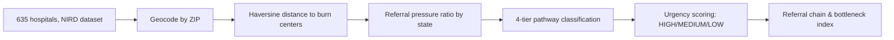

# Advancing Burn Care Referral Networks

> **HeatMap Hackathon 2026 · Challenge Area 1**
>
> Using NIRD structural data to map referral bottlenecks, geographic gaps, and build a decision-support framework for US burn care.

---

## The Problem

40% of trauma hospitals in the US face a quality or distance gap when referring burn patients. 31.5% are structurally isolated — far from any ABA-verified burn center. Referral decisions today are made without systematic data on what care is actually available or how far away it is.

This project analyses every trauma-to-burn referral pathway across all 635 hospitals in the NIRD dataset, classifies each by urgency, and surfaces the structural gaps that put patients at risk — using no patient records at all.

---

## Dataset at a Glance

| Metric | Value |
|---|---|
| Hospitals analysed | **635** |
| Burn centers | **136** |
| Trauma-only hospitals | **499** |
| States without verified care | **18** |
| ABA-verified centers | **76** |
| Total burn beds | **2,080** |
| Average burn beds per center | **15.3** |

---

## Repository Structure

```
├── Final_HeatMapBurn.ipynb     # Main analysis — gap mapping, distance analysis,
│                               # pediatric coverage, pathway classification,
│                               # urgency scoring model, decision-support output
├── Referral_Chain.ipynb        # Referral chain construction — tier assignment,
│                               # Local → Trauma → Burn chains, bottleneck index,
│                               # hops analysis, Texas focus
└── README.md
```

> **Note:** The NIRD dataset (`NIRD 20230130 Database_Hackathon.xlsx`) is not included. Request access via the [American Burn Association](https://ameriburn.org) / BDATA portal. Once obtained, update the file path in the first cell of each notebook.

---

## Notebooks

### `Final_HeatMapBurn.ipynb`

The primary analysis notebook. Runs end-to-end from raw data loading through chart generation.

**Sections:**

| Section | What it does |
|---|---|
| **Data loading & cleaning** | Loads NIRD Excel sheet; strips whitespace from flag columns; standardises ZIP codes to 5-digit; re-derives `TRAUMA_ADULT`/`TRAUMA_PEDS` from level columns to fix edge cases (e.g. Froedtert Hospital) |
| **Capability & verification flags** | Derives `is_burn`, `is_trauma`, `is_trauma_only`, `is_both`, `is_burn_peds`, `is_l1_trauma`, `is_l2_trauma`; assigns 4-tier verification: Tier 1 (ABA + State), Tier 2 (ABA only), Tier 3 (State only), Tier 4 (none) |
| **Burn center summary** | Counts centers, beds, nationally verified centers, states with coverage |
| **Geographic gap analysis** | Identifies 7 states with no burn center; 43 states with no nationally verified center |
| **Referral pressure ratio** | Computes trauma-only hospitals ÷ (verified centers + 1) per state; flags structural bottlenecks |
| **Critical state analysis** | Identifies 38 states with no verified center AND active L1 trauma load |
| **Geocoding** | Geocodes all 635 hospitals by ZIP using `pgeocode` (Nominatim US); stores `lat`/`lon` on `data_df` |
| **Distance to nearest burn center** | Haversine distances from every trauma-only hospital to: (a) nearest any burn center, (b) nearest nationally verified burn center; computes `quality_gap_miles` |
| **Charts 1–2** | Critical states bar chart; distance distribution histogram; top-20 most underserved continental hospitals with AK/HI callout |
| **Burn bed supply vs demand** | State-level scatter: trauma-only hospitals (demand proxy) vs total burn beds (supply); `beds_per_trauma_hospital` metric |
| **Pediatric coverage** | Flags `is_peds_trauma` and `is_peds_trauma_only`; identifies states with no pediatric burn center; distances to nearest peds burn center |
| **Charts 3–4** | Supply/demand scatter; adult vs peds distance gap histograms; states-without-peds-burn bar chart |
| **Referral pathway classification** | Classifies all 499 trauma-only hospitals: Direct / Unverified / Long-Haul / Isolated; breakdown by L1 vs L2 |
| **Charts 5** | Pathway distribution bar; L1 vs L2 donut charts; state-level stacked bar sorted by chain risk score |
| **Urgency scoring model** | `HIGH` / `MEDIUM` / `LOW` flags per hospital based on: distance to verified center, quality gap, state referral pressure — no patient data required |
| **Charts 6** | Urgency distribution by group; HIGH-urgency hospitals per state |
| **Decision-support output** | Simulated point-of-care cards showing nearest verified adult and pediatric burn center, distance, urgency flag, and quality gap warning |

---

### `Referral_Chain.ipynb`

Builds and analyses the multi-hop referral chain: Local Hospital → Trauma Center → Burn Center.

**Sections:**

| Section | What it does |
|---|---|
| **Data loading & geocoding** | Fresh load of NIRD dataset; geocodes by ZIP using `pgeocode` |
| **Proximity analysis** | Cross-joins non-burn trauma hospitals with burn centers; finds nearest burn center per trauma hospital; average distance = **51.03 miles** |
| **Tier assignment** | Assigns each hospital to Tier 1 (local), Tier 2 (trauma), or Tier 3 (ABA/state verified burn center) |
| **Pairwise distance table** | Full cross-join of all hospitals; Haversine distances for every pair |
| **Local → Trauma mapping** | For every hospital, finds the nearest Tier-2 trauma center |
| **Trauma → Burn mapping** | For every trauma center, finds the nearest Tier-3 burn center |
| **Referral chain construction** | Merges both mappings into a complete `Local_Hospital → Nearest_Trauma → Nearest_Burn` table with per-leg and total distances |
| **Hops KPIs** | `avg_hops` across all 635 hospitals; `pct_two_hops` (% requiring 2 transfers); **Bottleneck Index** = `inbound_referrals / (BURN_BEDS + 1)` |
| **Texas focus** | Filters chain to TX; hops summary; sample referral chains |

---

## Methodology



### 1. Geocoding
All 635 hospitals geocoded by 5-digit ZIP code using `pgeocode` (Nominatim US database). Coordinates stored as `lat`/`lon`.

### 2. Haversine Distance
Great-circle distances computed using the Haversine formula (Earth radius = 3,958.8 miles).

```python
def haversine_miles(lat1, lon1, lat2, lon2):
    R = 3958.8
    lat1, lon1, lat2, lon2 = map(np.radians, [lat1, lon1, lat2, lon2])
    dlat, dlon = lat2 - lat1, lon2 - lon1
    a = np.sin(dlat/2)**2 + np.cos(lat1) * np.cos(lat2) * np.sin(dlon/2)**2
    return R * 2 * np.arcsin(np.sqrt(a))
```

### 3. Referral Pressure Ratio
Per state: trauma-only hospitals ÷ (ABA-verified centers + 1). Higher = more structural bottleneck.

### 4. 4-Tier Pathway Classification
Each of the 499 trauma-only hospitals classified into one of four categories:

| Pathway | Criteria |
|---|---|
| **Direct to verified** | < 100 mi to verified center, no quality gap |
| **Nearby but unverified** | Nearest center is unverified; verified center ≤ 100 mi away |
| **Long-haul** | 100–200 mi to nearest verified center |
| **Isolated** | > 200 mi to any verified burn center |

### 5. Urgency Scoring Model
`HIGH / MEDIUM / LOW` flags derived entirely from structural fields — no patient records needed:

```
HIGH   → distance to verified > 200 mi  OR  state pressure ratio > 6
MEDIUM → distance to verified > 100 mi  OR  quality gap > 50 mi
LOW    → direct access to verified center within 100 mi
```

| Flag | Count | Share |
|---|---|---|
| 🔴 HIGH | 157 | 31.5% |
| 🟡 MEDIUM | 63 | 12.6% |
| 🟢 LOW | 279 | 55.9% |

### 6. Referral Chain & Bottleneck Index
3-tier chain: Local (Tier 1) → Trauma (Tier 2) → Burn (Tier 3). Each hospital mapped to its nearest next-tier facility via cross-join + `idxmin()` groupby.

**Bottleneck Index** = `inbound_referrals / (BURN_BEDS + 1)`

Identifies which trauma centers funnel the most local hospitals per available burn bed at their downstream burn center.

---

## Key Findings

- **18 states** have no quality-assured burn care. 7 have no burn center at all: ND, MT, MS, NH, SD, DE, AK.
- **107 hospitals** are 100+ miles from verified burn care; 31 are 200+ miles away.
- **163 hospitals** face a quality gap — nearest burn center is unverified, requiring an average of **+72.2 extra miles** to reach verified care.
- **Illinois** has the highest referral pressure ratio: 52 trauma hospitals, 3 verified centers — ratio **13.0**.
- **CT, KY, DE** each have a Level 1 pediatric trauma center but no in-state pediatric burn center.
- **29%** of all burn centers carry zero designation — no ABA verification, no state oversight.
- **L2 trauma hospitals** face disproportionately more isolation than L1: 7.8% fully isolated vs 2.4% for L1.

---

## Texas Case Study

| Hospital | Distance to nearest adult burn center | Notes |
|---|---|---|
| UMC El Paso (L1 trauma) | 296 miles | 760 miles to nearest **pediatric** burn center |
| Doctors Hospital at Renaissance | 220 miles | No verified burn care in all of South Texas |

**Texas hops summary (`Referral_Chain.ipynb`):**

| Metric | Value |
|---|---|
| Total hospitals (all tiers) | 48 |
| Average hops | 0.90 |
| Hospitals requiring > 1 transfer | 2.08% (1 hospital) |
| Direct burn centers (0 hops) | 6 |

---

## Installation & Setup

```bash
# 1. Clone the repo
git clone https://github.com/your-org/burn-care-referral-networks.git
cd burn-care-referral-networks

# 2. Install dependencies
pip install pandas numpy matplotlib pgeocode openpyxl jupyter

# 3. Place the NIRD dataset at the path in cell 1 of each notebook, or update the path:
#    pd.read_excel("path/to/NIRD 20230130 Database_Hackathon.xlsx", ...)

# 4. Launch
jupyter notebook
```

**Run order:**
1. `Final_HeatMapBurn.ipynb` — run all cells top to bottom; generates all charts
2. `Referral_Chain.ipynb` — self-contained; can run independently

---

## Output Charts

| File | Description |
|---|---|
| `chart1_critical_states.png` | L1/L2 trauma hospitals per state with no verified burn center |
| `chart2a_distance_distribution.png` | Distance histogram to nearest verified burn center (colour-coded danger zones) |
| `chart2b_top20_underserved.png` | Top 20 most underserved continental US hospitals with AK/HI callout panel |
| `chart3_supply_demand_scatter.png` | Burn bed supply vs trauma demand by state; dot size = L1 trauma count |

---


## Acknowledgements

Thanks to the HeatMap Hackathon organisers, the American Burn Association, and BDATA for providing the NIRD dataset.

---

*635 hospitals · 136 burn centers · 499 referral pathways · 76 ABA-verified centers · 2,080 burn beds · Python + NIRD + Haversine · HeatMap Hackathon 2026*
